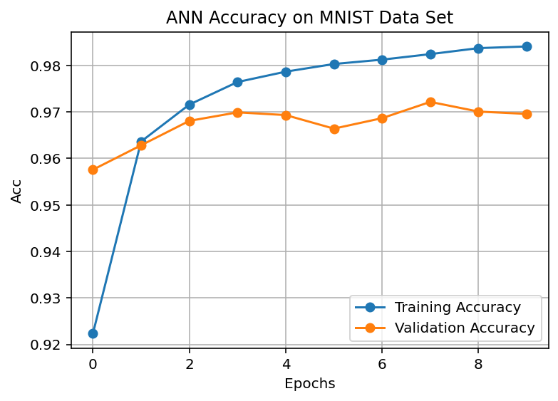
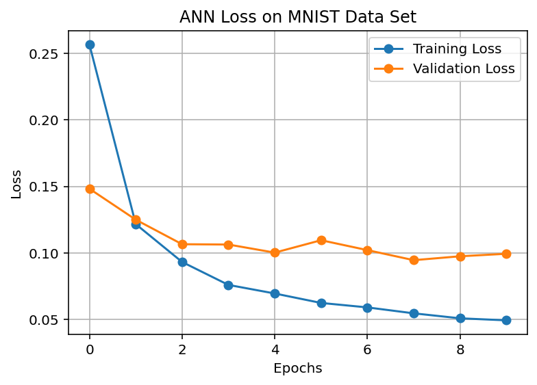

# 🚀 MNIST Handwritten Digit Recognition (ANN - Keras)

This repository contains an Artificial Neural Network (ANN) model developed using Keras and Python to solve the classic MNIST handwritten digit classification problem.

This project demonstrates core deep learning concepts including data pre-processing, model training, and performance visualization.

## ✨ Project Highlights

* **Model Architecture:** A simple yet effective fully connected Artificial Neural Network (ANN) using Dense layers.
* **Framework:** Built with **Keras** (using the TensorFlow backend) for clean and efficient model definition.
* **Performance:** Achieved a **~97.0%** validation accuracy on the test set.
* **Key Concepts:** Demonstrated data normalization, one-hot encoding, and analysis of training dynamics (loss and accuracy).

## 📊 Performance Analysis

The model shows strong performance with a quick convergence during the initial epochs. The difference between training and validation accuracy suggests a slight tendency towards **overfitting**, which is common and manageable.

| Metric | Result |
| :--- | :--- |
| **Validation Accuracy** | $\approx 0.970$ |
| **Training Accuracy** | $\approx 0.983$ |
| **Optimizer** | Adam |
| **Loss Function** | Categorical Crossentropy |

### Accuracy Plot

A visual representation of the model's learning curve:



### Loss Plot



## 🛠️ Prerequisites

To run this code locally, ensure you have the following packages installed:

```bash
pip install tensorflow matplotlib numpy
